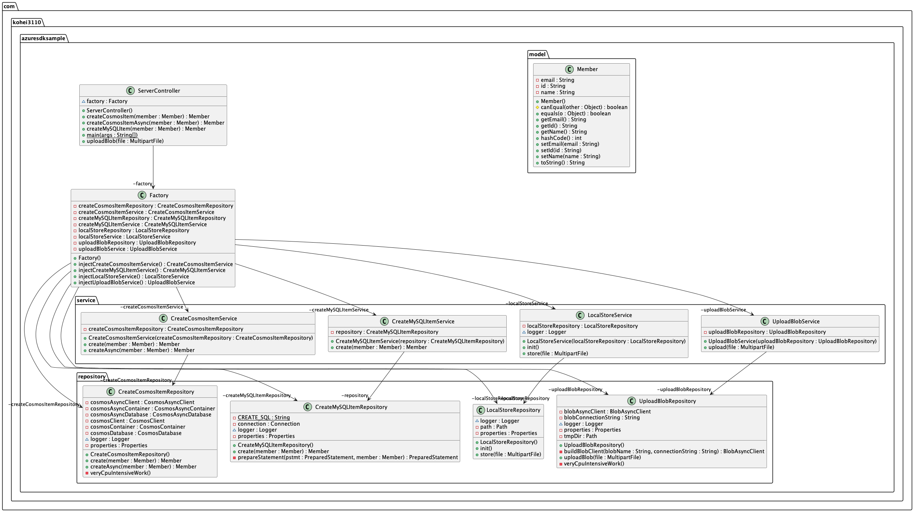

# エキスパートになるための Azure PaaS での Java 開発！ サンプルコード

## API 一覧

本サンプルで作成する API 一覧は[こちら](https://kohei3110.github.io/MOSeminar-Q1/dist/index.html)にまとめています。

## API を使うために

### Azure Database for MySQL （フレキシブルサーバー） の作成

以下の Docs を参考にしながら、Azure Database for MySQL (フレキシブルサーバー) を作成します。

- [クイックスタート: Azure portal を使用して Azure Database for MySQL - フレキシブル サーバーを作成する](https://learn.microsoft.com/ja-jp/azure/mysql/flexible-server/quickstart-create-server-portal)
- [Azure Database for MySQL - フレキシブル サーバーでデータベースを作成して管理する](https://learn.microsoft.com/ja-jp/azure/mysql/flexible-server/how-to-create-manage-databases)

作成したデータベースにおいて、以下のような `member` 表を作成します。

```
> desc member;
+-------+-------------+------+-----+---------+-------+
| Field | Type        | Null | Key | Default | Extra |
+-------+-------------+------+-----+---------+-------+
| id    | varchar(60) | NO   | PRI | NULL    |       |
| name  | varchar(60) | YES  |     | NULL    |       |
| email | varchar(60) | YES  |     | NULL    |       |
+-------+-------------+------+-----+---------+-------+
```

`member` 表作成用の SQL は、`scripts/create_mysql.sql` に記載しています。

### Cosmos DB の作成

以下の Docs を参考にしながら、Cosmos DB を作成します。

- [クイックスタート: Azure portal を使って Azure Cosmos DB のアカウント、データベース、コンテナー、項目を作成する](https://learn.microsoft.com/ja-jp/azure/cosmos-db/nosql/quickstart-portal)

データベース名は **items**、コンテナー名は **member** とします。


### Blob Storage の作成

以下の Docs を参考にしながら、ストレージアカウント・Blob コンテナーを作成します。

- [クイック スタート:Azure portal を使用して BLOB をアップロード、ダウンロード、および一覧表示する](https://learn.microsoft.com/ja-jp/azure/storage/blobs/storage-quickstart-blobs-portal)

Blob コンテナー名は **blobs** とします。


### application.properties の作成

- `src/main/resources` 配下に `application.properties` を追加します。`application.properties` には、以下の値をセットします。
- `application.properties` 作成にあたっては、`src/main/resources/application.sample.properties` をご参考にしてください。

| キー                | 値                                                                                                                                      |
| :------------------ | :-------------------------------------------------------------------------------------------------------------------------------------- |
| url                 | Azure Database for MySQL の JDBC URL。                                                                                                  |
| user                | Azure Database for MySQL のユーザー名（非管理者）。                                                                                     |
| password            | Azure Database for MySQL のパスワード（非管理者）。                                                                                     |
| cosmos.endpoint     | Cosmos DB エンドポイント。                                                                                                              |
| cosmos.key          | Cosmos DB 接続キー。                                                                                                                    |
| cosmos.database     | Cosmos DB データベース名（本ハンズオンでは **items** とします）。                                                                       |
| cosmos.container    | Cosmos DB コンテナ名（本ハンズオンでは **member** とします）。                                                                          |
| tmp.dir             | App Service・Spring Apps で使用する、アップロード対象のファイルを保存する一時ディレクトリ（`/tmp`）。詳細は【補足】を参照してください。 |
| blob.endpoint       | ファイルアップロード先の Blob Storage のエンドポイント。                                                                                |
| blob.container.name | ファイルアップロード先の Blob Storage コンテナ名。本ハンズオンでは **blobs** とします。                                                 |

上記をもとに、`src/main/resources/appilication.properties` を作成します。

```application.properties
url=jdbc:mysql://${AZ_DATABASE_SERVER_NAME}.mysql.database.azure.com:3306/${AZ_DATABASE_NAME}?useSSL=true&sslMode=REQUIRED&serverTimezone=UTC
user=${AZ_MYSQL_NON_ADMIN_USERNAME}@${AZ_DATABASE_SERVER_NAME}
password=${AZ_MYSQL_NON_ADMIN_PASSWORD}
cosmos.endpoint=https://xxxxxxxxxxxxxxxxxxx.documents.azure.com:443/
cosmos.key=xxxxxxxxxxxxxxxxxxxxxxxxxxxxxxxx==
cosmos.database=items
cosmos.container=member
tmp.dir=/tmp
blob.endpoint=DefaultEndpointsProtocol=https;AccountName=xxxxxxxxxx;AccountKey=xxxxxxxxxxxxxxxxxxxxxxxxxxxxxxxxxxxxxxxxxxxxxxx==;EndpointSuffix=core.windows.net
blob.container.name=blobs
```

### 【補足】 ファイルアップロード API について

アプリケーションサーバーとして、App Service・Spring Apps を使います。

App Service・Spring Apps は、一時ディレクトリとして `/tmp` をマウントしています。

ファイルアップロード API の動きとして、ユーザーからリクエストされたファイルを一時的に `/tmp` に保存した後、ファイルを Blob Storage にアップロードします。


## UML



## 参考

- [Azure SDK for Java を使用する](https://learn.microsoft.com/ja-jp/azure/developer/java/sdk/overview)
- [Azure SDK for Java](https://azure.github.io/azure-sdk-for-java/)
- [Azure SDK for Java / GitHub](https://github.com/Azure/azure-sdk-for-java)
- [Understanding the Azure App Service file system](https://github.com/projectkudu/kudu/wiki/Understanding-the-Azure-App-Service-file-system)
- [Java on Azure 実践開発【Blob Upload ②: App Service ローカル保存後アップロード編】](https://qiita.com/kk31108424/items/366649945294a50b808a)
- [クイックスタート: Azure Database for MySQL で Java と JDBC を使用する](https://learn.microsoft.com/ja-jp/azure/mysql/single-server/connect-java?tabs=password)
